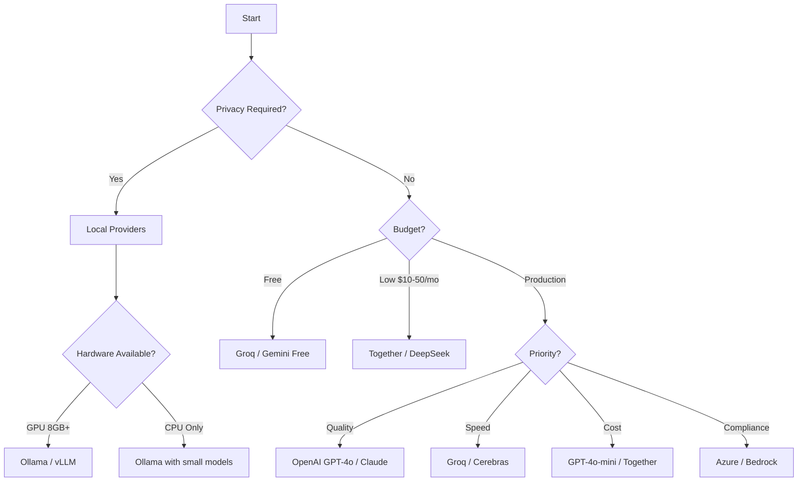

# Provider Selection Guide

This guide helps you choose the best LLM provider based on your requirements.

## Decision Flowchart



## Quick Recommendations

### By Primary Requirement

| Requirement | Provider | Model | Why |
|-------------|----------|-------|-----|
| **Getting Started** | Groq | llama-3.3-70b-versatile | Free, fast, easy setup |
| **Best Quality** | Anthropic | claude-3.5-sonnet | Best reasoning, safe |
| **Best Value** | OpenAI | gpt-4o-mini | Quality/cost balance |
| **Lowest Cost** | DeepSeek | deepseek-v3 | $0.07/1M tokens |
| **Fastest** | Groq | llama-3.1-8b-instant | 500+ tokens/sec |
| **Privacy** | Ollama | llama3.2 | Fully local |
| **Enterprise** | Azure OpenAI | gpt-4o | SLAs, compliance |
| **Long Context** | Google | gemini-1.5-pro | 2M token context |

### By Industry

=== "E-commerce"

    **Recommended**: GPT-4o-mini or Groq

    - High volume review analysis
    - Cost-effective
    - Fast turnaround

    ```python
    LLMConfig(provider="openai", model="gpt-4o-mini")
    # or
    LLMConfig(provider="groq", model="llama-3.3-70b-versatile")
    ```

=== "Financial Services"

    **Recommended**: Azure OpenAI or Claude

    - Compliance requirements
    - High accuracy needed
    - Audit trails

    ```python
    LLMConfig(
        provider="azure",
        deployment_name="gpt-4o",
        azure_endpoint="https://your-resource.openai.azure.com"
    )
    ```

=== "Healthcare"

    **Recommended**: Local (Ollama/vLLM) or Azure

    - HIPAA compliance
    - Data privacy
    - No external API calls

    ```python
    LLMConfig(provider="ollama", model="llama3.1:70b")
    ```

=== "Gaming / Entertainment"

    **Recommended**: Groq or Together

    - High volume
    - Fast responses
    - Cost-effective

    ```python
    LLMConfig(provider="groq", model="llama-3.3-70b-versatile")
    ```

=== "Research"

    **Recommended**: Claude or GPT-4o

    - Best reasoning
    - Detailed analysis
    - Reproducibility

    ```python
    LLMConfig(provider="anthropic", model="claude-3.5-sonnet")
    ```

## Cost Optimization

### Free Options

1. **Groq Free Tier**
    - 30 requests/min
    - 100K tokens/day
    - Great for development

2. **Google Gemini Free**
    - 15 requests/min
    - Good for low volume

3. **Ollama (Local)**
    - Unlimited (hardware cost only)
    - Best for privacy

### Budget Tiers

| Monthly Budget | Recommended Setup |
|----------------|-------------------|
| $0 | Groq free + Ollama fallback |
| $10-25 | DeepSeek + Groq |
| $25-50 | Together AI + DeepSeek |
| $50-100 | GPT-4o-mini primary |
| $100-500 | GPT-4o + Claude mix |
| $500+ | Enterprise (Azure/Bedrock) |

### Cost Comparison Table

| Provider | Model | 1M Input | 1M Output | 10M Reviews* |
|----------|-------|----------|-----------|--------------|
| Groq | LLaMA 3.3 70B | Free | Free | $0 |
| DeepSeek | V3 | $0.07 | $0.27 | ~$5 |
| Together | LLaMA 70B | $0.88 | $0.88 | ~$15 |
| OpenAI | GPT-4o-mini | $0.15 | $0.60 | ~$10 |
| OpenAI | GPT-4o | $2.50 | $10.00 | ~$175 |
| Anthropic | Claude 3.5 | $3.00 | $15.00 | ~$250 |

*Estimated for typical sentiment analysis workload

## Quality Comparison

### Sentiment Analysis Accuracy

Based on internal benchmarks:

| Provider | Model | Accuracy | F1 Score |
|----------|-------|----------|----------|
| Anthropic | claude-3.5-sonnet | 94.2% | 0.941 |
| OpenAI | gpt-4o | 93.8% | 0.936 |
| OpenAI | gpt-4o-mini | 92.1% | 0.918 |
| Groq | llama-3.3-70b | 91.5% | 0.912 |
| DeepSeek | v3 | 90.8% | 0.904 |
| Together | llama-70b | 90.5% | 0.901 |
| Ollama | llama3.2 | 88.2% | 0.878 |

### Summarization Quality

| Provider | Coherence | Accuracy | Conciseness |
|----------|-----------|----------|-------------|
| Claude 3.5 Sonnet | Excellent | Excellent | Excellent |
| GPT-4o | Excellent | Excellent | Good |
| GPT-4o-mini | Good | Good | Good |
| LLaMA 3.3 70B | Good | Good | Good |
| LLaMA 3.2 | Fair | Fair | Good |

## Latency Comparison

Average response time for typical requests:

| Provider | Model | First Token | Full Response |
|----------|-------|-------------|---------------|
| Groq | LLaMA 8B | 50ms | 200ms |
| Groq | LLaMA 70B | 100ms | 400ms |
| Cerebras | LLaMA 70B | 80ms | 300ms |
| OpenAI | GPT-4o-mini | 200ms | 800ms |
| OpenAI | GPT-4o | 300ms | 1.2s |
| Anthropic | Claude 3.5 | 250ms | 1.0s |
| Ollama (GPU) | LLaMA 8B | 150ms | 500ms |
| Ollama (CPU) | LLaMA 8B | 500ms | 3s |

## Feature Requirements

### Vision Support

For analyzing images (product photos, screenshots):

- **OpenAI**: GPT-4o, GPT-4-turbo
- **Anthropic**: Claude 3.5 Sonnet, Claude 3
- **Google**: Gemini 1.5 Pro, Gemini 2.0
- **Together**: LLaVA models
- **Ollama**: LLaVA, BakLLaVA

### Long Context

For analyzing many reviews at once:

| Provider | Model | Context |
|----------|-------|---------|
| Google | gemini-1.5-pro | 2M tokens |
| Anthropic | claude-3.5 | 200K tokens |
| OpenAI | gpt-4o | 128K tokens |
| Groq | llama-3.3-70b | 128K tokens |

### Structured Output

For reliable JSON responses:

- **Best**: OpenAI (JSON mode), Anthropic
- **Good**: Groq, Together, Fireworks
- **Variable**: Local models (depends on prompting)

## Fallback Strategies

### Recommended Fallback Chain

```python
from sentimatrix.config import SentimatrixConfig, LLMConfig

config = SentimatrixConfig(
    llm=LLMConfig(
        provider="groq",
        model="llama-3.3-70b-versatile",
        fallback=[
            # Fallback 1: Another fast provider
            {"provider": "together", "model": "meta-llama/Llama-3-70b-chat-hf"},
            # Fallback 2: Premium provider
            {"provider": "openai", "model": "gpt-4o-mini"},
            # Fallback 3: Local (always available)
            {"provider": "ollama", "model": "llama3.2"},
        ]
    )
)
```

### By Reliability Requirement

=== "High Availability (99.9%+)"

    ```python
    LLMConfig(
        provider="openai",
        model="gpt-4o-mini",
        fallback=[
            {"provider": "anthropic", "model": "claude-3-haiku"},
            {"provider": "groq", "model": "llama-3.3-70b"},
        ],
        max_retries=5,
        retry_delay=1.0,
    )
    ```

=== "Cost-Optimized"

    ```python
    LLMConfig(
        provider="groq",
        model="llama-3.3-70b",
        fallback=[
            {"provider": "deepseek", "model": "deepseek-v3"},
            {"provider": "ollama", "model": "llama3.2"},
        ]
    )
    ```

=== "Quality-First"

    ```python
    LLMConfig(
        provider="anthropic",
        model="claude-3.5-sonnet",
        fallback=[
            {"provider": "openai", "model": "gpt-4o"},
            {"provider": "openai", "model": "gpt-4o-mini"},
        ]
    )
    ```

## Summary Recommendations

### For Most Users

**Start with Groq** - Free tier, fast, good quality:

```python
LLMConfig(provider="groq", model="llama-3.3-70b-versatile")
```

### For Production

**Use GPT-4o-mini** - Best balance of quality, cost, reliability:

```python
LLMConfig(provider="openai", model="gpt-4o-mini")
```

### For Best Quality

**Use Claude 3.5 Sonnet** - Best reasoning and safety:

```python
LLMConfig(provider="anthropic", model="claude-3.5-sonnet")
```

### For Privacy

**Use Ollama** - Fully local, no data leaves your machine:

```python
LLMConfig(provider="ollama", model="llama3.1:70b")
```
